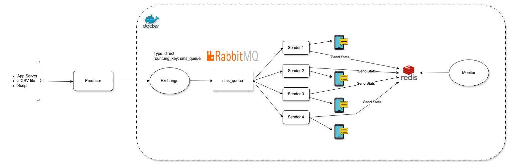

# SMS Simulation Project

This project simulates an SMS alert service using **RabbitMQ** and **Redis**. The service consists of three main components:

1. **Producer**: Generates and sends a configurable number of SMS messages to RabbitMQ.
2. **Sender**: Consumes messages from RabbitMQ and simulates sending SMS messages while updating statistics in Redis.
3. **Monitor**: Tracks and displays statistics of the messages sent by the sender, including success/failure rates and average time per message.




---

## Requirements

The project uses the following technologies:

- **Python 3.12**
- **Poetry** for dependency management
- **RabbitMQ** for queuing messages
- **Redis** for tracking statistics
- **Docker Compose** for running all components inside docker VMs

## Features

- **Producer**: Simulates SMS messages and sends them to a RabbitMQ queue.
- **Sender**: Consumes the messages from RabbitMQ, simulates sending SMS, and updates stats in Redis (messages sent, failed, and average time per message).
- **Monitor**: Continuously reads statistics from Redis and displays them in the console with structured logging.
- **Logging**: Uses a custom JSON formatter to log structured data.

---

## Setup Instructions

## Local Setup:

### 1. Clone the Repository

```bash
git clone https://github.com/your-username/sms_simulation.git
cd sms_simulation
```

### 2. Install Dependencies
This project uses Poetry to manage dependencies. Make sure you have Poetry installed.
To install poetry use this [Link](https://python-poetry.org/docs/)

To install the dependencies, run:
```bash
poetry install
poetry shell
```

### 3. Install rabbitmq and redis locally
**Install Redis:**

On macOS (with Homebrew):
```bash
brew install redis
brew services start redis
```

On Ubuntu:

```bash
sudo apt update
sudo apt install redis-server
sudo systemctl enable redis-server.service
sudo systemctl start redis-server.service
```

**Install RabbitMQ: On macOS (with Homebrew):**

```bash
brew install rabbitmq
brew services start rabbitmq
````
On Ubuntu:

```bash
sudo apt update
sudo apt install rabbitmq-server
sudo systemctl enable rabbitmq-server
sudo systemctl start rabbitmq-server
```

### 3. Set Up .env File
Create a .env file in the root of the project and configure the environment variables:

```bash
RABBITMQ_HOST=localhost
REDIS_HOST=localhost
QUEUE_NAME=sms_queue
MONITOR_UPDATE_INTERVAL=5
MEAN_PROCESSING_TIME=2
FAILURE_RATE=0.1
```
- `MEAN_PROCESSING_TIME` is in seconds and represents the average processing time for each message.
- `FAILURE_RATE` is a probability, where 0.1 indicates a 10% likelihood of message failure.

### 4. Running the Components
You can run each component (Producer, Sender, Monitor) from your local machine.

**Producer**
To run the Producer (to generate SMS messages and send them to RabbitMQ):

```bash
python producer.py --num-messages 1000
```

**Sender**
To run the Sender (to consume and send SMS messages from RabbitMQ):

```bash
python sender.py
```

**Monitor**
To run the Monitor (to track stats like messages sent, failed, and average time):

```bash
python monitor.py --update-interval 5
```

### 5. Scaling Sender Instances

You can scale the number of sender.py instances dynamically using the `scale_sender.sh` script.

```bash
chmod u+x scale_sender.sh
./scale_sender.sh 5
```

This will start 5 instances of `sender.py` and redirect the logs for each instance to the sender_logs/ directory.

Verify the sender logs
```bash
tail -f sender_logs/sender_instance_*
```

---
## Docker Setup:

### 1. Clone the Repository

```bash
git clone https://github.com/your-username/sms_simulation.git
cd sms_simulation
```

### 2. Install Dependencies
This project uses Poetry to manage dependencies. Make sure you have Poetry installed.

To install the dependencies, run:
```bash
poetry install
```

### 3. Set Up .env File
Create a .env file in the root of the project and configure the environment variables:

```bash
RABBITMQ_HOST=localhost
REDIS_HOST=localhost
QUEUE_NAME=sms_queue
MONITOR_UPDATE_INTERVAL=5
MEAN_PROCESSING_TIME=2
FAILURE_RATE=0.1
```

### 4. Docker Setup
- To run RabbitMQ, Redis, and the services (Producer, Sender, and Monitor) in Docker containers, use **Docker Compose**:
- If you have already tried local setup, shutdown the redis and rabbitmq instances to avoid port conflicts with [Steps to Shut Down Local Instances](#steps-to-shut-down-local-instances)
- If docker and docker-compose not installed, please use the [official link](https://docs.docker.com/compose/install/)
```bash
docker-compose -d up --build 
```

- To Scale sender instances with docker compose

```bash
docker-compose up --scale sender=5 -d --build
```

This will start the following services:

- **RabbitMQ** (port `5672`)
- **RabbitMQ Management UI** (port `15672`)
- **Redis** (port `6379`)
- **Monitor**
- **Sender**

### 5. Verify the individual Components
You can verify each component (Sender, Monitor) from your local machine.

**Producer**
To run the Producer (to generate SMS messages and send them to RabbitMQ):

```bash
python producer.py --num-messages 1000
```

**Sender**
To verify the Sender progress (to consume and send SMS messages from RabbitMQ):

```bash
docker-compose logs -f sender
```

**Monitor**
To verify the Monitor Stats (to track stats like messages sent, failed, and average time):

```bash
docker-compose logs -f monitor
```
----

## Clean Up:

#### local setup:

1. Gracefully shutdown all the sender instances
```bash
pkill -f sender.py
```

2. Verify
```bash
ps aux | grep sender.py
```

#### docker setup:

1. Shutdown the docker services:
```bash
docker-compose down
```

2. Remove the images
```bash
docker rm sms_simulator-sender sms_simulator-monitor redis rabbitmq
```

---

## Design Consideration:
This section covers the key design choices made for the project:

**1. Why RabbitMQ?**

RabbitMQ is used as a message broker because it provides reliable and scalable communication between services. In this project, RabbitMQ enables the producer to publish SMS messages to a queue, which is then consumed by multiple sender instances. We chose RabbitMQ due to:

- **Durability:** RabbitMQ supports durable queues and persistent messages, ensuring messages are not lost if RabbitMQ crashes.
- **Scalability:** It can easily handle scaling by allowing multiple consumers (senders) to process messages concurrently.
- **Reliability:** It provides acknowledgment mechanisms, ensuring that messages are delivered exactly once, even in case of failures.

**2. Why Redis?**

Redis is used to track statistics (e.g., number of messages sent, failed, and average processing time). Redis is chosen because:

- **In-memory Speed:** Redis is an in-memory key-value store, making it extremely fast for storing and retrieving stats in real-time.
- **Simplicity:** Redis offers a simple interface for storing and updating data.
- **Persistence Options:** Although Redis is primarily in-memory, it can persist data to disk, which helps retain stats even after restarts.

---

## Future Enhancements:

Here are some potential enhancements that can be added to the project in the future:

**1. Testing with Pytest:**

- Unit and integration tests can be written using pytest to ensure the correctness of each component, including RabbitMQ
    message handling, Redis stats tracking, and overall message flow.

**2. Persistent Volumes:**

- Use Docker volumes to persist RabbitMQ and Redis data, ensuring that messages and stats remain intact even if the 
    containers are removed or restarted.

**3. Security:**
- No security is provided for Redis and RabbitMQ in this demo project. In production, secure connections
    should be configured for both Redis and RabbitMQ to protect sensitive data and ensure authentication.

**4. CI/CD Pipeline:**
- Implement a CI/CD pipeline to automatically build Docker images for the project and push them to a container registry 
    (e.g., Docker Hub or a cloud-based image repository like Google Container Registry or AWS ECR).

**5. Logging to a File for Better Observability:**
- Although logs are currently printed to the console, they should also be logged to a file using structured logging for 
    better observability and to track system behavior over time.

---

### Steps to Shut Down Local Instances
**Stop Redis (Locally):**

On Ubuntu:

```bash
sudo systemctl stop redis-server
```

On macOS (with Homebrew):

```bash
brew services stop redis
```

**Stop RabbitMQ (Locally):**

On Ubuntu:

```bash
sudo systemctl stop rabbitmq-server
```

On macOS (with Homebrew):

```bash
brew services stop rabbitmq
```

# References:
1. https://python-poetry.org/docs#ci-recommendations
2. https://www.cloudamqp.com/blog/part4-rabbitmq-for-beginners-exchanges-routing-keys-bindings.html
3. https://medium.com/@albertazzir/blazing-fast-python-docker-builds-with-poetry-a78a66f5aed0
4. https://dev.to/farcellier/package-a-poetry-project-in-a-docker-container-for-production-3b4m
5. https://www.cloudamqp.com/blog/how-to-run-rabbitmq-with-python.html
6. https://hatchjs.com/pika-blockingconnection-vs-selectconnection/
